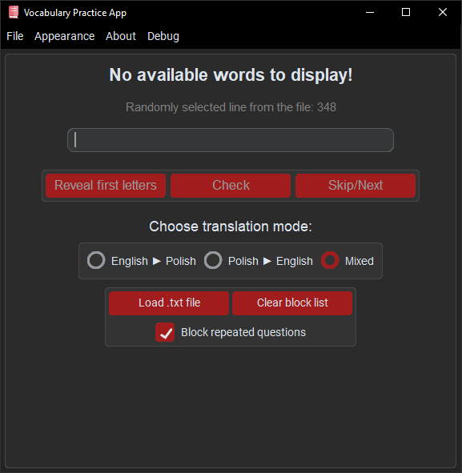

# Vocabulary Practice App

**Vocabulary Practice App** is a simple and effective tool for practicing vocabulary between any two languages using your own word lists.

## How to Use the Vocabulary Practice App

### 1. (Optional) Set Up a Virtual Environment

**For Windows:**
```bash
python -m venv venv
.\venv\Scripts\activate
pip install -r requirements.txt
```

**For Linux:**
```bash
python3 -m venv venv
source venv/bin/activate
pip install -r requirements.txt
```

---

### 2. Prepare Your Vocabulary File

- Create a `.txt` file containing your vocabulary.
- The **first line** must be a header indicating the two languages.
- Each following line should be a word pair, separated by a dash (`-`) with spaces on both sides.

**Example file:**
```text
English - Polish
Astronaut - Astronauta
Barrister - Adwokat
Chief executive officer - Dyrektor generalny
```

**Format requirements:**
- The header is required and helps the app identify translation directions.
- Each word pair must follow this format:  
  `Word in language A - Word in language B`

---

### 3. Launch the App

- Open the application and use the menu to load your vocabulary file.

---

### 4. Choose a Practice Mode

- **Language 1 → Language 2**
- **Language 2 → Language 1**
- **Mixed** (default)

---

### 5. Start Practicing!

- Type in the translation, check your answer, get hints if needed, and track your accuracy.

---

### Keyboard Shortcuts

The app supports the following hardcoded keyboard shortcuts (these cannot be changed... for now):

| Shortcut                     | Action                |
|------------------------------|-----------------------|
| <kbd>Enter</kbd>             | Check your answer     |
| <kbd>→</kbd>                 | Skip to the next word |
| <kbd>Ctrl</kbd>+<kbd>C</kbd> | Clear blocked list   |
| <kbd>Ctrl</kbd>+<kbd>O</kbd> | Open vocabulary file  |

---

## Required Libraries

| Library                                                         | Purpose                    | Installation                  |
|-----------------------------------------------------------------|----------------------------|-------------------------------|
| [CustomTkinter](https://github.com/TomSchimansky/CustomTkinter) | Modern UI components       | `pip install customtkinter`   |
| [CTkMenuBar](https://github.com/Akascape/CTkMenuBar)            | Modern MenuBar             | `pip install CTkMenuBar`      |
| [Pillow](https://pypi.org/project/pillow/)                      | Image handling             | `pip install pillow`          |

## Examples

Here are examples of how the application looks:

 



