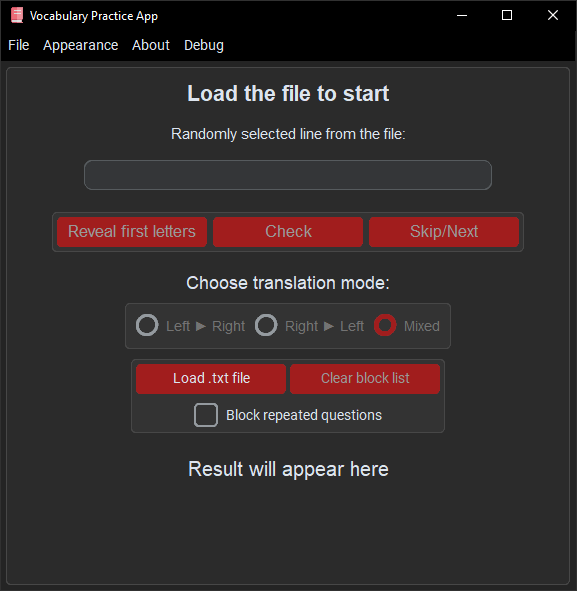
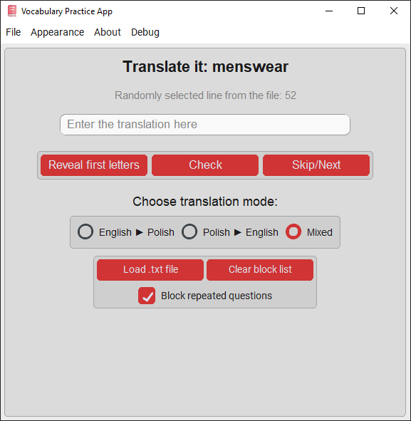

## Version: 1.2.0 [18.04.2025]

# Vocabulary Practice App

**Vocabulary Practice App** is a simple and effective tool for practicing vocabulary between any two languages using your own word lists.

## How to Use It?

1. **Prepare a `.txt` file with your vocabulary.**  
   The file should start with a **header line** indicating the two languages, followed by word pairs separated by a dash `-`.

   ### 📄 Structure:
   - The **header** is required and helps the app identify translation directions.
   - Word pairs must follow this format: `Language1Word - Language2Word`

   ### Example:
   ```text
   English - Polish
   Astronaut - Astronauta
   Barrister - Adwokat
   Chief executive officer - Dyrektor generalny
   ```

2. **Launch the app** and load your vocabulary file using the menu.

3. **Choose a mode**:
- Language 1 → Language 2
- Language 2 → Language 1
- Mixed (default)

4. **Start practicing!**  
Type in the translation, check your answer, get hints if needed, and track your accuracy.

---

## Required Libraries

| Library                                                         | Purpose                    | Installation                  |
|-----------------------------------------------------------------|----------------------------|-------------------------------|
| [CustomTkinter](https://github.com/TomSchimansky/CustomTkinter) | Modern UI components       | `pip install customtkinter`   |
| [CTkMenuBar](https://github.com/Akascape/CTkMenuBar)            | Modern MenuBar             | `pip install CTkMenuBar`      |
| [Pillow](https://pypi.org/project/pillow/)                      | Image handling             | `pip install pillow`          |

### To install all the required packages, use the following command in a terminal (make sure you have Python and pip installed):

```bash
pip install -r requirements.txt
```


## Examples

Here are examples of how the application looks:

 



